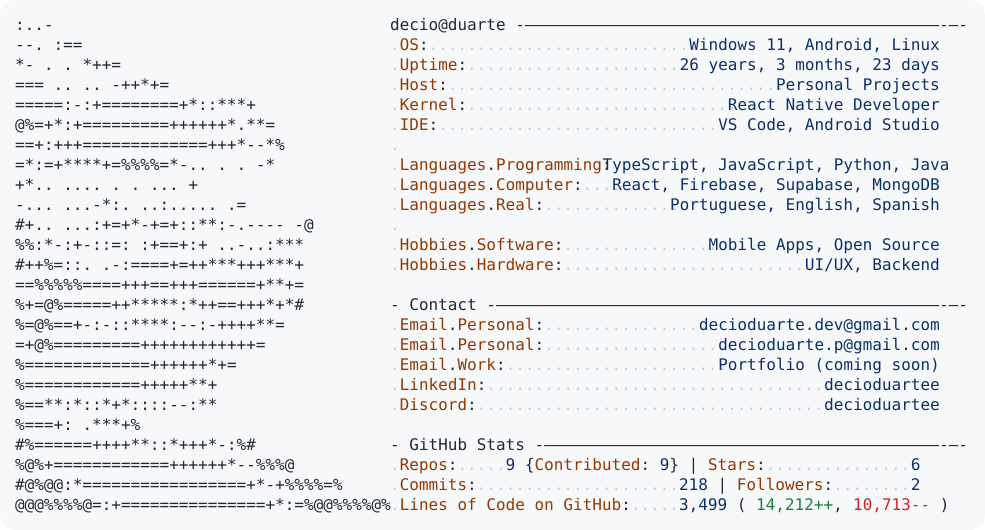

<a href="https://github.com/decioduartee/decioduartee">
  <picture>
    <source media="(prefers-color-scheme: dark)" srcset="./dark_mode.svg">
    <source media="(prefers-color-scheme: light)" srcset="./light_mode.svg">
    
  </picture>
</a>

## Update stats

```powershell
$env:ACCESS_TOKEN="YOUR_GITHUB_TOKEN"
python today.py --login decioduartee
```

You can also set `$env:GITHUB_LOGIN="decioduartee"` and run `python today.py`.
